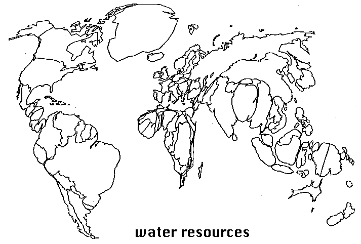
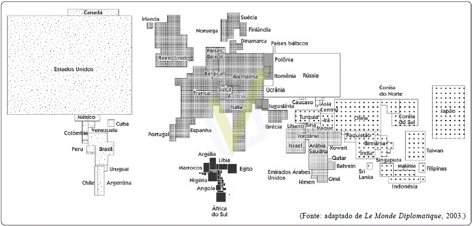

```{r setup, include=FALSE}
options(htmltools.dir.version = FALSE)
```

```{r xaringan-themer, include=FALSE, warning=FALSE}
library(xaringanthemer)
style_duo_accent(
  primary_color = "#1381B0",
  secondary_color = "#FF961C",
  inverse_header_color = "#FFFFFF"
)
```

class: center, middle

# Discussão sobre século XXI

### Especialistas x generalistas x interdisciplinares

---
class: inverse, center, middle

# Dilema ou integração?
### Tecnologia x humanização dos processos e das decisões
### HARD x SOFT
---
## Categorias de análise da Geografia
#### Espaço Geográfico
De um lado, os sistemas de objetos condicionam a forma como se dão as ações e, de outro, o sistema de ações leva a criação de objetos novos ou se realiza sobre objetos preexistentes. É assim que o espaço encontra a sua dinâmica e se transforma (SANTOS, M. 2012. p.63).
#### Paisagem
#### Território
#### Região
#### Lugar

---
## Representação de fenômenos espaciais

A. Como escolher o tipo de dado espacial?   
B. Como escolher o sistema de coordenadas?   
C. Como escolher a unidade espacial (nível de agregação)?   
D. Qual a diferença entre um mapa e um cartograma?   
E. O que é anamorfose?   
```{r echo=FALSE, out.width='60%', fig.align = 'center'}

```

---
## Representação de fenômenos espaciais (cont...)
F. O que é anamorfose?
```{r echo=FALSE, out.width='100%', fig.align = 'center'}

```

---
## Representação de fenômenos espaciais (cont...)

G. O que é geocodificação?   
H. Qual a diferença entre geocodificação e geoprocessamento? 

---

class: inverse, center, middle
# QUAL A DIFERENÇA ENTRE: CARTOGRAFIA DIGITAL E ANÁLISE ESPACIAL 

---
## Atividades da semana
+ mapa temático
+ layout de impressão no QGIS
+ geocodificação

---
class: center, middle

# Dúvidas??????
